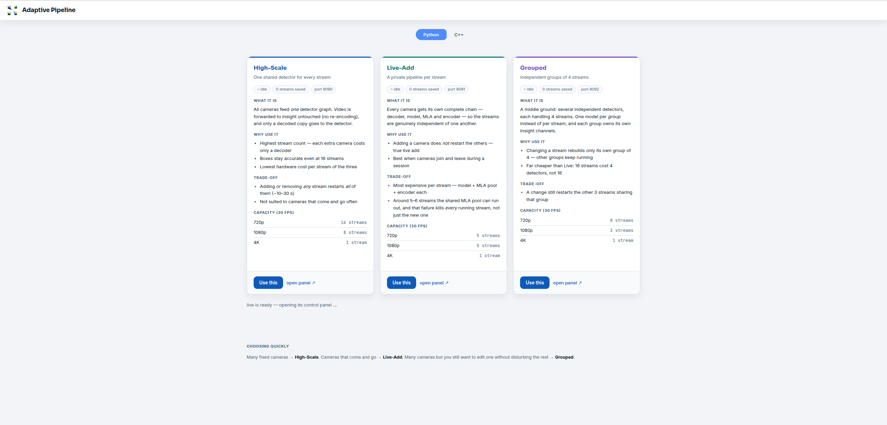
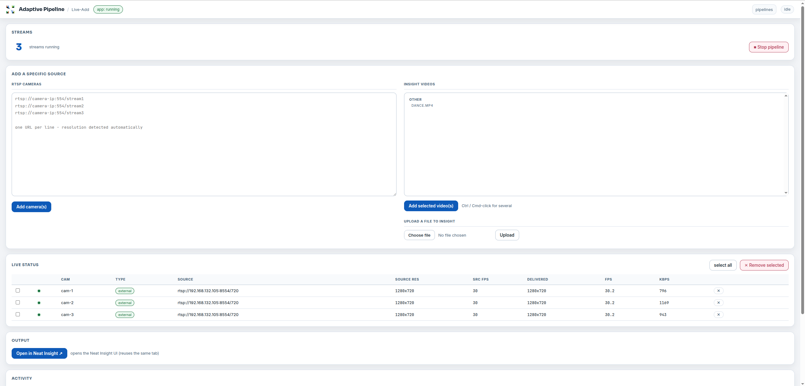
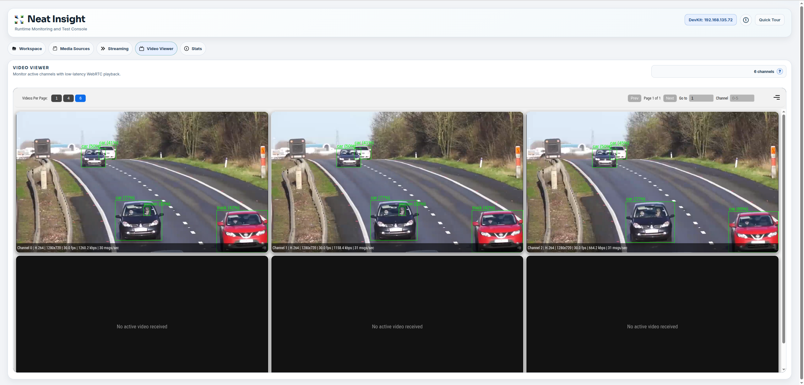

# Adaptive Resolution Object Detection

Run YOLO26 object detection across many RTSP camera streams on a SiMa.ai Modalix
DevKit, and watch the detections in Neat Insight — all from a browser. Add and
remove cameras, switch between three pipeline topologies, and see per-stream
resolution and frame rate live.

## What you need

- a **SiMa.ai Modalix DevKit** — detection runs on the board
- a **Neat SDK container** on a host the board can reach over the network

There is no way to run this without the board.

## One-time setup

Three steps, once per machine. Everything after this is done in the browser.

**1. Clone**, inside the SDK container, somewhere in the tree the board
NFS-mounts:

```bash
git clone https://github.com/SiMa-ai/apps-adaptive-object-detection.git
cd apps-adaptive-object-detection
```

**2. Get the model** into `models/`:

```bash
mkdir -p models && cd models
sima-cli modelzoo get yolo_26n
cd ..
```

That writes `yolo_26n_mpk.tar.gz`, which is the filename the pipelines expect.

**3. Point it at your machines** — your SDK container's IP as the board sees it,
and your DevKit's IP:

```bash
cd pipelines
./setup-adaptive-pipeline.sh <host-ip> <board-ip>
```

This configures both machines and starts the web servers. It prints a pass/fail
summary; every line should be a green tick before you continue. Run
`./setup-adaptive-pipeline.sh --help` for the details, and re-run it any time
either machine's address changes.

Then open **`http://<board-ip>:8080/`** and stay in the browser.

## Choosing a pipeline

The chooser explains each option and shows how many streams it sustains at
30 fps. Click **Use this** on one — it starts that pipeline and stops the others,
since all three share the same hardware.



| | Best for | Adding a camera |
| --- | --- | --- |
| **High-Scale** | The most cameras. One shared detector, video passed through untouched. | Restarts every stream (~10–30 s) |
| **Live-Add** | Cameras that come and go. Each gets its own private pipeline. | Others keep running |
| **Grouped** | A middle ground. Independent groups of 4 streams. | Restarts only that group of 4 |

The **Python / C++** toggle at the top applies to all three. Python is the
default and needs nothing extra; C++ becomes available once you
[build it](BUILDING.md).

## Running a pipeline

**Use this** opens that pipeline's control panel.



**Add cameras.** Paste RTSP URLs into the box on the left, one per line, and
click **Add camera(s)**. You can mix with any resolution.  Resolution is detected for you.

**Or use video files.** Pick clips from **Insight videos** on the right and
click **Add selected video(s)** — Ctrl or Cmd-click for several. To add a new
clip, use **Choose file** then **Upload**.

**Watch it run.** **Live status** lists every stream with its source resolution,
delivered resolution, frame rate and bitrate. A green dot means it is running.

**Remove streams.** Tick the streams you want gone and click **Remove
selected**, or use the ✕ on a single row.

**Stop everything** with **Stop pipeline**, top right.

## Seeing the detections

Click **Open in Neat Insight** in the panel's Output section. Each stream is one
channel, with bounding boxes drawn over the video.



## If something looks wrong

**No boxes, but video is arriving.** Check your source frame rate. Use clips
around 25–30 fps — a much faster source (150 fps, say) plays normally but
produces no detections, because Insight drops pending metadata before the
matching frame arrives.

**Adding a camera seems stuck.** On High-Scale and Grouped, adding a stream
rebuilds the pipeline and takes 30–90 seconds. That is expected. Live-Add is the
one that adds without interrupting the others.

**Streams fail above a certain count.** Every board has a ceiling, and it is
lower at higher resolutions — the chooser's capacity table is the guide. Watch
the per-stream frame rate in Live status and back off when it drops below the
source rate.

**Nothing loads after a network change.** If either machine's IP changed, re-run
`./setup-adaptive-pipeline.sh <host-ip> <board-ip>` and reload the page.

**The C++ toggle does nothing.** It needs a binary — see [BUILDING.md](BUILDING.md).

## Licence

Apache 2.0 — see [LICENSE](LICENSE).
