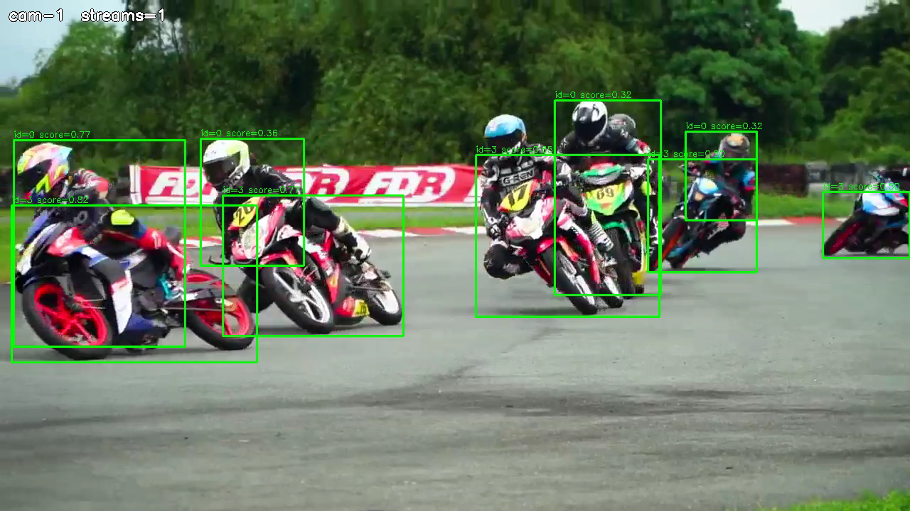

# Adaptive Resolution Object Detection

Multi-stream YOLO26 object detection for the SiMa.ai Modalix DevKit. Runs
detection across many RTSP streams and delivers each stream's video and
detection metadata to Neat Insight, with a browser UI for driving it.

| Field | Value |
| --- | --- |
| Category | object-detection |
| Difficulty | Advanced |
| Tags | object-detection, rtsp, multistream, adaptive-resolution, insight, yolo26 |
| Languages | C++, Python |
| Binary Name | adaptive-resolution-object-detector |
| Model | yolo26n-det-int8-b1 |

## Hardware requirement

**This is not a host application.** It needs:

- a **SiMa.ai Modalix DevKit** — the detector runs on the board, not on your
  machine;
- a **Neat SDK container** on a host the board can reach over the network;
- an **NFS mount** exporting the container's workspace to the board **at the
  same absolute path on both sides**. The pipeline UI servers execute from that
  share.

[`pipelines/setup-adaptive-pipeline.sh`](pipelines/setup-adaptive-pipeline.sh)
configures **both machines**: it edits the container's `/etc/environment`, the
board's `/etc/fstab` and the board's NFS watchdog timer, and restarts Insight.
Read `./setup-adaptive-pipeline.sh --help` before running it.

There is no way to try this without the board.

## Concept

Runs YOLO26 object detection across multiple RTSP streams and sends each
stream's video and detection metadata to Insight, with a choice of two graph
topologies.

One entry point per language carries both topologies, chosen with `--mode`:

**`--mode adaptive`** (default) builds **one graph per stream**. Streams can be
added or removed while the others keep running: the app polls its config file
and diffs `streams.sources`, and only the affected stream is built or torn down.
Every stream is decoded, detected and delivered at its source's native size.

**`--mode fused`** builds **one graph for all streams**, fanning into a single
shared detector. Adding a stream rebuilds the whole graph, so it is not live —
in exchange, there are no per-stream bridges, which is what keeps detections
correct at higher stream counts.

Both forward the source H.264 to Insight without re-encoding it. The two take
**different config schemas** (see Configure); handing one the other's config
fails validation rather than running with settings you did not ask for.

The C++ and Python entry points take identical flags. That is what lets
[`pipelines/`](pipelines/README.md) switch implementation language from a
browser without changing anything else.

## Preview



## Install

Install the Neat SDK first, if you have not already — see the
[SiMa.ai developer documentation](https://developer.sima.ai/). Then clone this
repository **inside the SDK container**, somewhere within the tree the board
NFS-mounts:

```bash
git clone https://github.com/SiMa-ai/apps-adaptive-object-detection.git
cd apps-adaptive-object-detection
```

## Prepare the model

The model pack ships as a release asset, so no account is needed:

```bash
mkdir -p models
curl -L -o models/yolo26n-det-int8-b1.tar.gz \
  https://github.com/SiMa-ai/apps-adaptive-object-detection/releases/download/v1.0.0/yolo26n-det-int8-b1.tar.gz
```

int8 is the default in `config.yaml` and in [`pipelines/`](pipelines/README.md)
because it is the build the published throughput numbers were measured on. bf16
is a drop-in alternative: fetch `yolo26n-det-bf16-mla_tess-b1.tar.gz` from the
[SiMa.ai Model Zoo](https://docs.sima.ai/) and point `model.path` at it.

## Prepare Insight

[Insight](https://developer.sima.ai/software/tools/insight/) can host the input
streams and render each output channel. Start the streams in the Insight Web UI,
copy their RTSP URLs into the config, and use the host and UDP ports reported by
`neat` for the output settings. Stream N publishes to `video_port + N` and
`metadata_port + N`.

Use sources at ~25–30 fps. A much faster clip (for example 150 fps) starts
normally and delivers video, but produces no detections: Insight evicts pending
metadata before the matching frame arrives.

## Configure

The two modes read different files. Paths are relative to the repository root,
so run the app from there.

**`--mode adaptive`** — `src/common/config.yaml`:

```yaml
model:
  path: models/yolo26n-det-int8-b1.tar.gz
  labels: src/common/coco_label.txt

streams:
  max_streams: 16              # default 8 if omitted
  sources:                     # edit while running to add/remove streams
    - id: cam-1
      rtsp_url: <first-rtsp-url>

output:
  insight:
    host: <insight-host-ip>
    video_port: 9000
    metadata_port: 9100
```

**`--mode fused`** — a bare `streams:` list, up to 64, and `*_port_base` keys:

```yaml
model:
  path: models/yolo26n-det-int8-b1.tar.gz
  labels: src/common/coco_label.txt

streams:
  - <first-rtsp-url>
  - <second-rtsp-url>

inference:
  max_inflight_per_stream: 1
  max_inflight_total: 8

output:
  insight:
    host: <insight-host-ip>
    video_port_base: 9000
    metadata_port_base: 9100
```

## Run

Both languages take the same flags; `--validate-config-only` checks a config
without opening any stream.

### Python

```bash
source ~/pyneat/bin/activate
pip install -r src/python/requirements.txt
SIMA_GST_RUN_INPUT_TIMEOUT_MS=120000 python3 src/python/main.py \
  --mode adaptive \
  --config src/common/config.yaml
```

### C++

Build it first (see Building), then:

```bash
SIMA_GST_RUN_INPUT_TIMEOUT_MS=120000 ./build/adaptive-resolution-object-detector \
  --mode adaptive \
  --config src/common/config.yaml
```

## Pipelines UI

[`pipelines/`](pipelines/README.md) drives both modes from a browser and
switches implementation language without editing anything:

```bash
cd pipelines
./setup-adaptive-pipeline.sh --help            # read this first
./setup-adaptive-pipeline.sh <host-ip> <board-ip>
```

Open `http://<board-ip>:8080/`.

| Pipeline | Runs | Port |
| --- | --- | --- |
| scale | `--mode fused`, one process | 8090 |
| live | `--mode adaptive` | 8091 |
| group | `--mode fused`, several processes, each owning a subset | 8092 |

The Python/C++ toggle on that page applies to all three. They share one MLA and
one set of Insight channels, so selecting one stops the others. C++ appears only
once a binary exists — a fresh clone has none until you build.

## Building

Only needed for the C++ implementation; the Python one runs from source.

```bash
cmake -S . -B build \
  -DCMAKE_TOOLCHAIN_FILE=cmake/aarch64-modalix.cmake \
  -DCMAKE_BUILD_TYPE=Release
cmake --build build -j"$(nproc)"
```

This cross-compiles for the board's aarch64 target and produces
`build/adaptive-resolution-object-detector`. It requires the Neat SDK's Modalix
sysroot, which the SDK container provides; the toolchain file reads `SYSROOT`,
`CC` and `CXX` from the environment.

## Troubleshooting

- Replace the placeholder RTSP URLs and Insight host before running.
- Addresses committed here are RFC 5737 documentation placeholders
  (`192.0.2.x`). `setup-adaptive-pipeline.sh` rewrites them to your real ones.
- Stop with SIGTERM, not SIGKILL. A killed process leaves decoder and CVU pools
  allocated, and the next run can then fail to allocate at a count that worked.
- Adding a stream in `adaptive` takes 30–90 s to rebuild; it is not instant.
- Video arriving with no boxes: check the source frame rate (see Prepare
  Insight), and that the Insight host and UDP ports match the config.
- Stream ceilings are per-board. Watch the per-channel rate and back off when it
  drops below the source rate.
- `output.debug_dir`, `output.save_every` and `runtime.profile` produce
  diagnostics.

## Source layout

```
src/cpp/          main.cpp (entry point), adaptive_app.h, fused_app.h
src/python/       main.py (entry point), adaptive_app.py, fused_app.py
src/common/       config.yaml, coco_label.txt
pipelines/        browser UI and the three pipeline drivers
support/          shared C++ helpers (config, RTSP probe, box decode)
models/           model packs (not committed; see Prepare the model)
```

Each language keeps both topologies behind one entry point, and the C++
implementations are headers in named namespaces so their helpers do not
collide.

## Licence

Apache 2.0 — see [LICENSE](LICENSE).
